# IELTS *Vault*

 
 

## Overview

**IELTS** ***Vault*** is a comprehensive prep tool for your IELTS (International English Language Testing System) examination. This guide covers installation and use of the app's various features. Let's get started!

---
 
 

## Tech Stack
-  Flutter
-  Firebase
-  In App Purchases
-  Cloud Functions
-  Google Cloud Messaging
-  AdMob
-  CodeMagic for CI/CD
-  Reactive Programming
-  Clean Code Architecture
-  Flutter Web For Admin Panel
-  Heroku
-  Digital Ocean
-  Deployed to PlayStore

## Setup

Use this [Google Play link](https://play.google.com/store/apps/details?id=tech.ieltsvault.ielts) to download and install the app on your Android device. Create a login using your name, email, and password. You may also create an account using your Google credentials. 

 

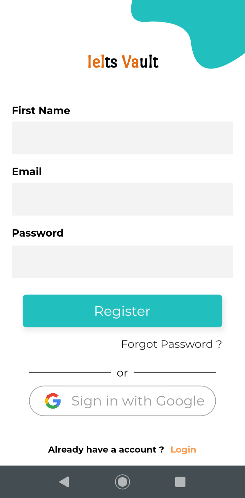

 
Signing in brings you to the main page.

---
 
 

## Home page

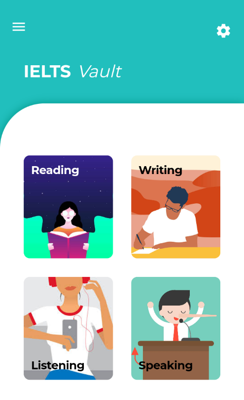

 

The mail screen contains 4 different categories of exercises: **Reading**, **Writing**, **Listening**, and **Speaking**. Each exercise is ranked *easy*, *medium,* or *hard*. Answers/suggested responses to the exercises are provided at the bottom of the pages.

- **Reading -** This section tests your ability to read and understand a written passage, and to answer questions about it. *Reading* contains 10 sub-categories for exercises: *True/False*, *Sentence Completion*, *Heading Competition*, *Summary Completion*, *Matching Paragraphs*, *MCQs*, *List Selection*, *Categorization*, *Matching Endings*, and *Short Answers.*

  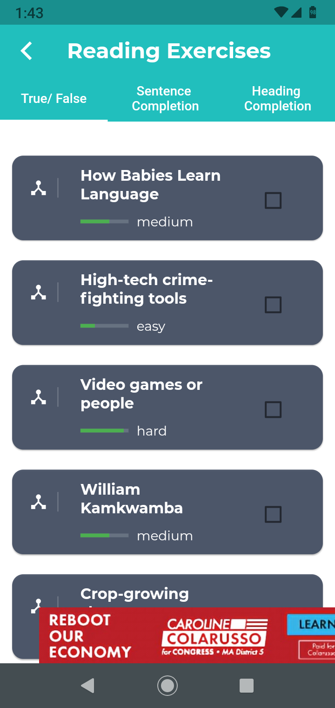

   
  
  Read the passage and practice answering the questions at the end.

  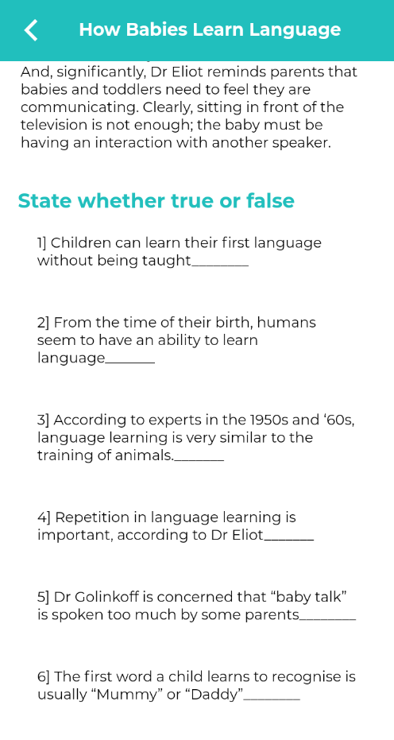

   

- **Writing -** This section provides a series of writing prompts to practice the written section of the IELTS. 

  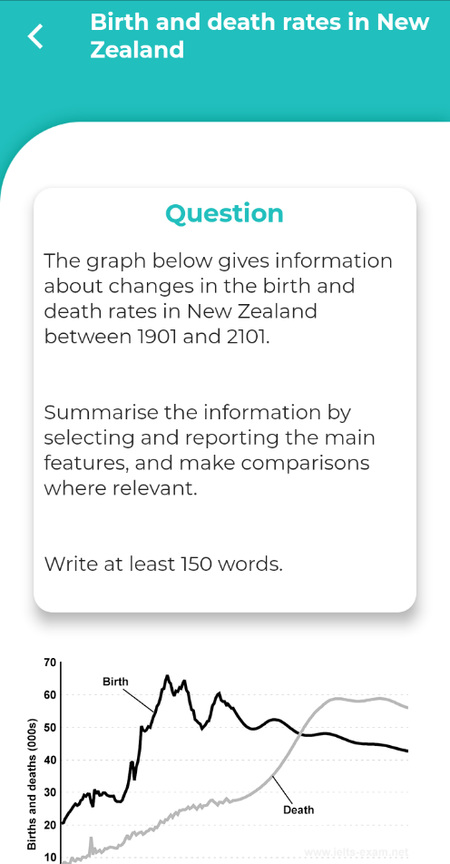

   
  
- **Listening -** This section contains a series of audio recordings, followed by questions.

  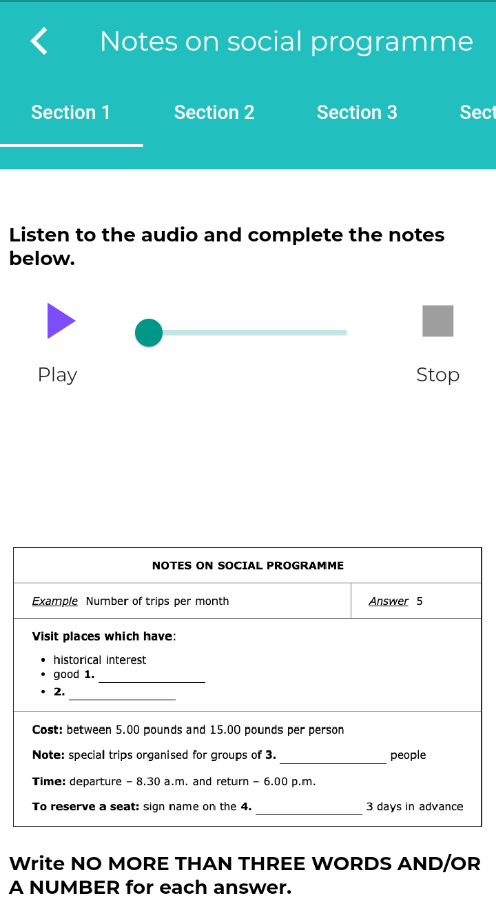

   
- **Speaking -** This section provides a series of speaking prompts to practice the spoken section of the IELTS.

  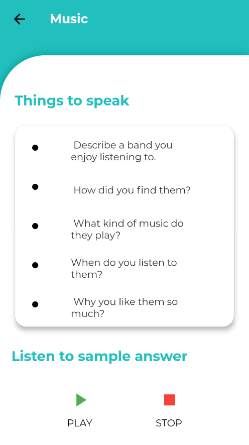

   

---
 
 

## Side menu

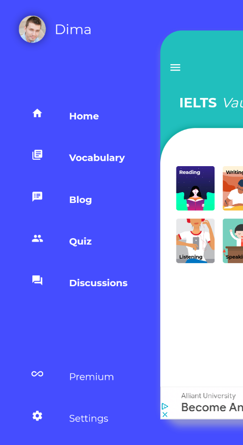

 

- **Home -** Brings you back to the main page.

- **Vocabulary -** Lets you practice English vocabulary with flash cards. Click the *audio* icon to hear the word spoken out loud.

  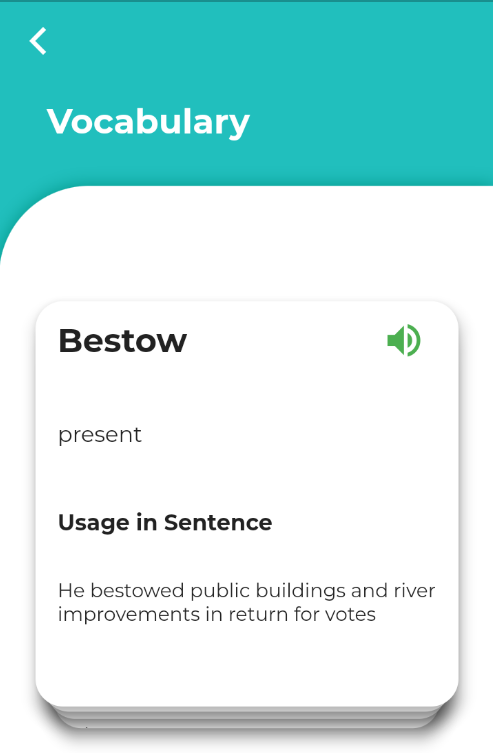

   

- **Blog -** Features articles that help further prepare IELTS takers for their exams.

- **Quiz -** Take a practice quiz here!

  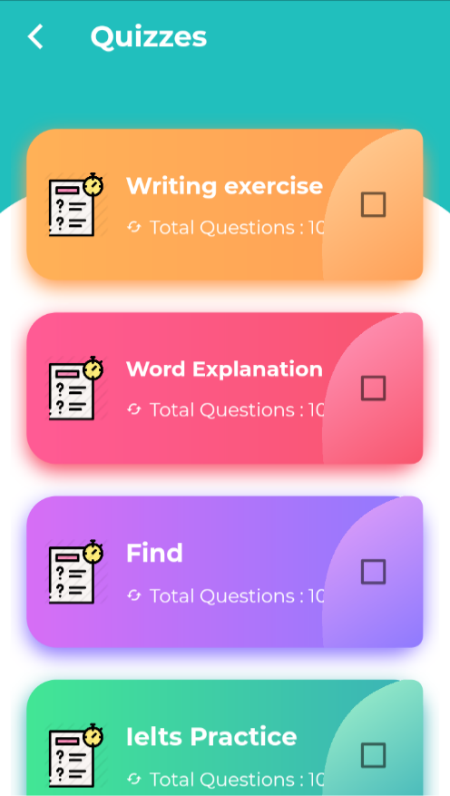
  
   
  
  Quizzes consist of 10 multiple-choice questions. They can be taken as many times as you wish.
  
  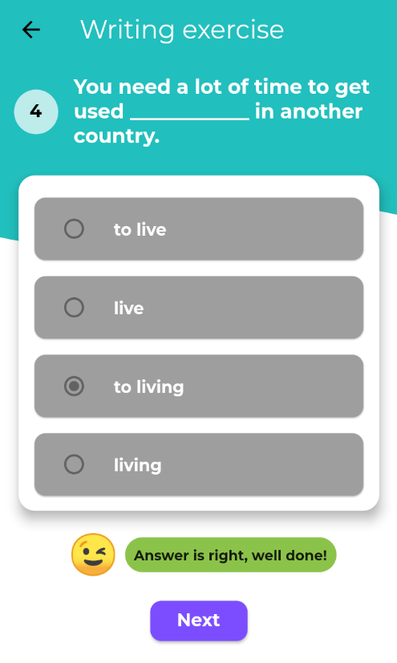
  
   
  
  
  
   
  
- **Discussions -** This feature requires the purchase of **Vault Premium**.

- **Premium -** Purchasing **Vault Premium** removes ads and unlocks *Discussions*. You may purchase the upgrade from *Google Play* for $2.50 USD.

  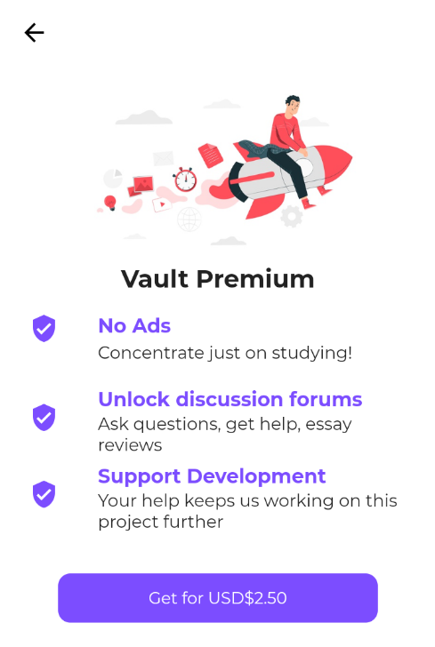
  
   

---
 
 

## About

The **IELTS** ***Vault***  team is:

**Nikhil Singh**

Developer

**Mrudula Vable**

Lead content strategist

 

Special thanks to the international open source community for all their contributions to this project!

This README was written by [Dima Gabriel](https://github.com/dgabriel123).
